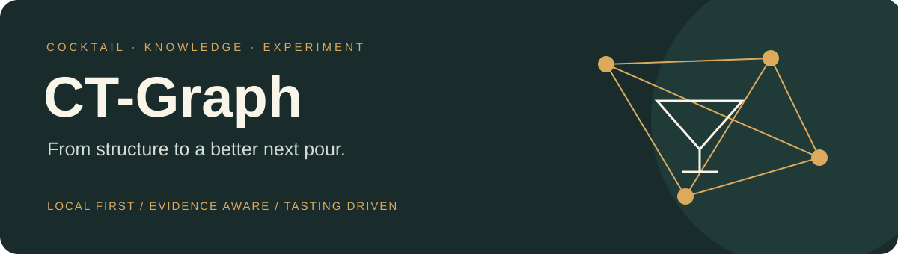
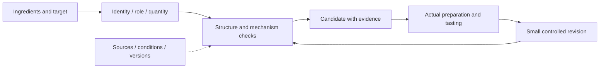

<p align="center"></p>

<p align="center"><a href="README.md">简体中文</a> · <strong>English</strong></p>
<p align="center">
<a href="https://github.com/HabitGraylight/CT-Graph/actions/workflows/ci.yml"></a>


</p>

# Understand the structure. Improve the next pour.

**CT-Graph** is a local cocktail knowledge and recipe-design workbench. It connects classic structures, ingredient identity, conditional mechanisms and real tasting feedback to explain what is missing, what may go wrong and what to try next.

**12 executable frameworks · 127 ingredient/product entries · seven-dimension Judge · six root-family navigation**

[Quick start](#quick-start) · [Capabilities](#capabilities) · [Knowledge methods](docs/BOOK_METHODS.md) · [Roadmap](docs/ROADMAP.md) · [Contributing](CONTRIBUTING.md)

## Capabilities

| Area | Available | Boundary |
|---|---|---|
| Recipe design | Framework checks, completion and role-based alternatives | Structure fit is not a predicted taste score |
| Ingredient identity | Chinese/English aliases, brands and ambiguity handling | Unknown products are not guessed |
| Judge | Seven dimensions, conditional mechanisms and evidence | Unobserved sensory scores stay empty |
| Iteration | Local tasting records, small revisions and personal preferences | Self-review is not independent validation |
| Book research | Local page search, evidence cards and reviewed design prompts | Scans need visual review; books are not redistributed |
| Causal modeling | Graph architecture and intervention drafts | No fitted model or identified causal effects yet |

The six root families organize knowledge separately from the twelve scoring templates. Flip is a knowledge node only; it has no executable scoring template yet.

## Quick start

Python 3.10+ is required. The core advisor needs no API key and runs offline.

```sh
git clone https://github.com/HabitGraylight/CT-Graph.git
cd CT-Graph
python -m pip install -r requirements.txt
python scripts/init_local.py
python server.py --port 8765
```

Open [http://127.0.0.1:8765](http://127.0.0.1:8765). Initialization preserves existing data and downloads no corpus. The workbench UI is currently Chinese; this page is the English project introduction.

### Use the advisor directly

```sh
python -X utf8 scripts/advise.py complete --frame sour --recipe "gin 45ml" --pantry "lemon juice,simple syrup" --compact
```

For structured input, keep request files under local `data/work/` and follow the [JSON interface](docs/JUDGE_REQUESTS.md). An assistant can also use the bundled [cocktail-advisor skill](.agents/skills/cocktail-advisor/SKILL.md).

## A traceable recommendation loop



Ingredient categories, brands and recipe versions remain distinct. Design prompts cover substitution, dilution, multiple modifier roles and pairing hypotheses. Evidence retains conditions and uncertainty. Only real tasting produces sensory observations; personal preferences do not automatically become general rules.

[Advisor](docs/ADVISOR.md) · [Judge](docs/JUDGE.md) · [Graph and causal design](docs/GRAPH_V2_DESIGN.md)

## Personal data stays local

The repository contains reusable code, methods, original diagrams, synthetic tests and source references. It excludes personal recipes, pantry lists, menus, generated PDFs, tasting records, books, extracted text, research notes and derived databases.

An explicit file manifest, default-deny ignore rules and a publication checker protect this boundary. New files are private by default. Automated checks do not replace a content review. See the [privacy policy](docs/PRIVACY.md).

## Extend the local knowledge base

Classic-recipe comparisons and pantry-to-classic matches are empty until a source corpus is built locally.

- [Source data](docs/DATA_NOTES.md): collect, build, validate and align; respect each source's terms.
- [Book workflow](docs/BOOK_METHODS.md): index searchable PDFs, visually review scans and approve evidence before rules.
- [Knowledge maintenance](docs/JUDGE.md): review candidates, publish versioned changes and retain prior versions.

Detailed technical documentation is currently primarily Chinese.

## Development

```sh
python -X utf8 -m unittest discover -s tests -q
node --check web/app.js
node --check web/judge.js
python scripts/check_publication.py
```

Initialize first. Three corpus-dependent integration tests explicitly skip when the local corpus is absent. CI uses an empty-data installation and never reads the maintainer's books or tasting records.

See [Contributing](CONTRIBUTING.md), [Roadmap](docs/ROADMAP.md) and [Changelog](CHANGELOG.md). Use synthetic examples and keep both project introductions in sync.

## Status and licensing

This is an evolving research prototype maintained through public collaboration. **The owner has not selected a license yet.** No LICENSE is supplied and no open-source license grant is claimed. Rights in third-party books, recipes and datasets remain separate.
