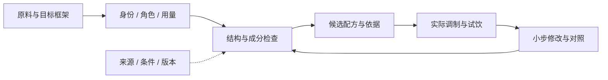

<p align="center"></p>

<p align="center"><strong>简体中文</strong> · <a href="README.en.md">English</a></p>
<p align="center">
<a href="https://github.com/HabitGraylight/CT-Graph/actions/workflows/ci.yml"></a>


</p>

# 从一杯酒的结构，到下一杯的改进

**CT-Graph** 是一个本地运行的鸡尾酒知识与配方设计工作台。它把传统框架、原料身份、成分机制和真实试饮连接起来，帮助回答：这份配方哪里不合理？缺什么？改哪一处最值得试？

**12 个可执行框架 · 127 个原料与品牌条目 · 七维 Judge · 六根型知识导航**

[快速开始](#快速开始) · [能力与边界](#能力与边界) · [知识方法](docs/BOOK_METHODS.md) · [路线图](docs/ROADMAP.md) · [参与贡献](CONTRIBUTING.md)

## 能力与边界

| 能力 | 已实现 | 边界 |
|---|---|---|
| 配方设计 | 按框架评分、补全、同角色配料建议 | 框架契合度不是好喝概率 |
| 原料对齐 | 中英文、品牌、类别及歧义识别 | 不猜未知产品成分 |
| 七维 Judge | 设计风险、定性机制、证据与验证建议 | 未试饮的感官分留空 |
| 改进闭环 | 记录试饮、比较小改动、按人保存偏好 | 自评不等于独立验证 |
| 书籍吸收 | 本地逐页检索、证据卡、人工审查后的设计规则 | 扫描件需视觉核对；不再分发书籍 |
| 因果建模 | 图谱结构、变量与干预草案 | 尚无拟合模型或已识别因果效应 |

六根型是知识组织视角，与 12 个评分模板分开。Flip 目前只有知识节点，没有自动配方评分模板。

## 快速开始

需要 Python 3.10+。无需 API 密钥；基础建议可离线运行。

```sh
git clone https://github.com/HabitGraylight/CT-Graph.git
cd CT-Graph
python -m pip install -r requirements.txt
python scripts/init_local.py
python server.py --port 8765
```

打开 **http://127.0.0.1:8765**。初始化不会覆盖已有数据，也不会下载语料。当前工作台界面为中文；英文项目介绍见 [English](README.en.md)。

### 直接调用建议引擎

```sh
python -X utf8 scripts/advise.py complete --frame sour --recipe "gin 45ml" --pantry "lemon juice,simple syrup" --compact
```

复杂请求写入本地 `data/work/`，按 [JSON 接口文档](docs/JUDGE_REQUESTS.md) 调用；也可使用项目内 [cocktail-advisor skill](.agents/skills/cocktail-advisor/SKILL.md)。

## 一条可追溯的建议链



- **身份层**：类别、品牌、具体产品与配方版本分别保存。
- **设计层**：先检查结构，再检查替换、稀释、辅酒多重作用与风味假设。
- **证据层**：保留来源、适用条件、版本及未确定内容。
- **观察层**：只有真实试饮才能产生感官评分；个人喜好不直接成为公共规则。

[建议引擎](docs/ADVISOR.md) · [Judge 设计](docs/JUDGE.md) · [图谱与因果方案](docs/GRAPH_V2_DESIGN.md)

## 私人资料留在自己的电脑

| 随仓库发布 | 仅留本地 |
|---|---|
| 通用代码、方法、原创图示、合成测试 | 配方、库存、酒单、菜单 PDF、试饮与偏好 |
| 采集和书籍索引工具 | 书籍、网页原文、提取文本与阅读笔记 |
| 来源引用与可审核的简短规则 | 派生数据库、请求、候选与生成结果 |

采用**逐文件发布白名单 + 默认忽略 + 发布检查**。新文件默认不上传；检查工具不能替代人工审查。[完整隔离规则](docs/PRIVACY.md)

## 按需扩展知识

基础安装不带经典配方语料，因此版本比较和库存经典匹配初始为空。

- [建立本地来源语料](docs/DATA_NOTES.md)：运行采集 → 构建 → 校验 → 对齐流程，遵守原来源条款。
- [书籍阅读流程](docs/BOOK_METHODS.md)：有文字层的 PDF 可逐页检索，扫描页保留视觉审阅状态。
- [知识维护](docs/JUDGE.md)：候选审核、版本化发布、旧版本保留，不静默覆盖。

## 开发与贡献

```sh
python -X utf8 -m unittest discover -s tests -q
node --check web/app.js
node --check web/judge.js
python scripts/check_publication.py
```

请先运行初始化。缺少本地语料时，三项语料集成测试会明确跳过。CI 在空数据环境验证；不读取维护者的个人书库或试饮记录。

欢迎提交可复现缺陷、来源核对与方法改进。使用合成案例，遵循 [贡献指南](CONTRIBUTING.md)，并同步更新中英文首页。[更新记录](CHANGELOG.md)

## 项目状态与许可

当前为持续迭代的研究原型，采用公开协作方式维护。**许可证待项目所有者确定**，暂不放置 LICENSE，也不宣称已获得开源许可授权。第三方书籍、配方与数据的权利独立于本项目。
