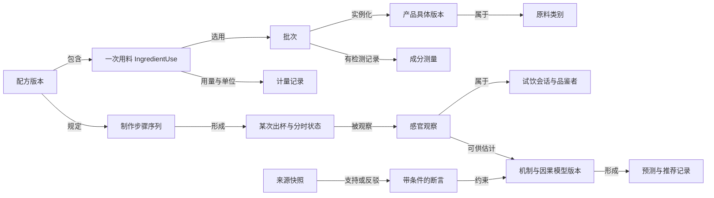
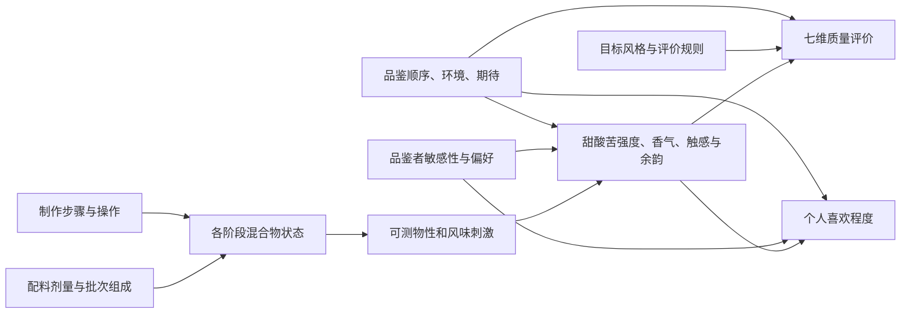

# Cocktail 图谱 V2：实体、机制、因果与试饮决策

日期：2026-09-16。状态：结构方案与可校验的因果模型草案；尚未接入线上因果估计。

## 1. 结论

成分到评价适合做因果建模。建议以一个有统一 ID 的领域知识图谱保存事实、来源、条件与实验，再按具体问题抽取变量层面的因果图。

领域图谱的节点可以是“君度产品”“一版配方”“一次试饮”；因果图的节点应是“橙酒用量 ml”“最终糖浓度 g/L”“出杯温度 ℃”“该次甜感强度”。品牌属于哪一类、文献由谁发表等关系不能一律变成因果箭头。

有向无环图（DAG）表达假设；结构因果模型（SCM）进一步为节点指定决定它的机制。画出箭头并不足以预测干预效果，还需判断现有数据能否识别该效果，再估计与检查稳健性。[DoWhy 官方方法说明](https://www.pywhy.org/dowhy/main/user_guide/causal_tasks/estimating_causal_effects/index.html)

## 2. 本次检查发现

| 现状 | 对升级的影响 |
|---|---|
| 原始图谱 7,092 节点、14,758 边，以来源、配方版本、原料表达、标签为主 | 可以继续作为来源事实层，不需要重爬来重建所有知识 |
| 图中有 1,770 个 ingredient 节点，另有未拆分表达；对齐词典为 127 个原料/产品 | 不能把旧 ingredient 数量当作已确认的独立化学原料数；应通过带证据的解析记录连接标准实体 |
| 对齐数据、Judge JSON、反馈 SQLite 各自保存 | 统一命名空间和 ID，才能从某次分数追溯到配方、用料、机制与来源 |
| `cocktail/judge.py` 主要按 `requires` 所列成分是否同时出现触发机制 | 缺少剂量、相态、工艺先后、产物状态、实际接触时间等条件；命中只是提示 |
| `context` 有部分温度、融水记录，但多数未用于状态迁移或机制估计 | 应让输入数据对应明确可观测变量，避免“填写了”看起来就像“已经参与推断” |
| 框架比例、核心槽位和方法匹配生成设计代理分 | 设计约束、真实感知与个人效用需要各自保留，避免模型学到自己的评分公式 |
| `learning.py` 的偏干倾向来自同框架累计偏甜记录；修订主要是固定小步长 | 这是可解释启发式，还未控制配方、糖浆浓度、品鉴顺序等差异，不能解读为因果估计 |
| 当前项目真实试饮记录为 0 | 首先设计能产生有效证据的记录与实验，不训练口味预测器或虚构因果系数 |

以上是本次读取本地数据与代码的结果，数量不是通用领域事实。

## 3. 五层逻辑结构

这些是同一系统的五个逻辑层，不要求五套数据库。

| 层 | 核心实体 | 主要用途 |
|---|---|---|
| ① 身份与配方 | IngredientCategory、Brand、ProductExpression、ProductVariant、Batch、RecipeVersion、IngredientUse、Framework | 中英文身份、市场/度数版本、批次、用量和结构角色 |
| ② 成分、工艺与状态 | ComponentClass、Compound、CompositionMeasurement、ProcessStep、MixtureState、MechanismClaim | 描述用了什么、如何制作、在哪个阶段发生什么 |
| ③ 证据与断言 | SourceSnapshot、Claim、EvidenceAssessment、ReviewRevision | 来源究竟支持哪条断言，什么条件下支持，有无反证 |
| ④ 试验与观察 | Experiment、Serving、TastingSession、Taster、Observation、Correction | 一杯如何制成、谁在什么时候观察到什么，哪些数据被更正 |
| ⑤ 因果与决策 | CausalModelVersion、Variable、Intervention、EffectEstimate、Prediction、RecommendationPolicy | 估计可识别的干预效果，比较方案，选择下一次有价值的试验 |

来源、生成活动、版本派生等关系可参考 [W3C PROV-O](https://www.w3.org/TR/prov-o/) 的语义；先保持 JSON/SQLite 的可读存储，再按查询需求决定是否增加图数据库。

### 建议的实体关系



这是实体关系图，允许存在关系环；不能原样作为因果 DAG 输入估计器。

### 身份与数量的具体改进

- 标准原料类别、品牌、具体产品、市场版本和批次分开。例如同品牌不同产品不能共享所有成分值；同产品酒精度变化也不能覆盖历史瓶标。
- 名称对齐保留 `raw_expression → Resolution → canonical_entity`；记录语言、候选、来源、判断状态和时间。只有确认同一实体才作为别名。
- 使用 `IngredientUse` 节点记录某版配方中的某次加入，包含角色、用量、单位、可选性和步骤。剂量不写在“金酒”实体上。
- 每个浓度数值绑定批次、温度/方法、单位、检测或标签依据及不确定性。糖、水、乙醇质量分数与体积分数区分；未知不当作 0。
- `ComponentClass` 与 `Compound` 分开。“挥发性香气成分”是一类未知组成，不伪装成已测定的具体分子。
- 类别角色是上下文相关的：橙酒在 Daisy 中承担甜味和香气，但不能推导为所有场景下的糖浆等量替代。

## 4. 成分到评价的因果路径



这是建议采用的机制假设骨架，不代表每条路径都已在鸡尾酒环境中实证确认。物理量与主观量分开建模；各具体问题还需补齐共同原因、测量过程和变量范围。

### 三个容易被忽略的区别

**甜感强度、甜度是否合适、总体喜欢程度不同。** 某人可能评“甜感 8/10”，同时认为“平衡 9/10”；不能把所有强烈感觉视作缺陷。建议先收集属性强度，再收集质量和喜欢程度。

**评分规则通常属于评价模型。** “符合经典比例所以加分”是编辑标准，不是物理因果定律。七项也不独立：温度、稀释可同时影响香气、触感与平衡。保留各项，避免重复的原因在汇总中被重复奖励或惩罚。

**反馈循环按杯次和时间展开。** `配方_t → 感知_t → 反馈_t → 推荐_(t+1) → 配方_(t+1)` 可以无环；不要在同一时点画“评分影响配方，配方又影响评分”的环后称其为 DAG。奶洗、过滤、融冰也应区分步骤前后状态。

## 5. 一个直接改善推荐的例子

当前 `improve` 可能建议糖浆 20 → 17.5 ml。这只改了一个用料项，却同时改变糖量、最终体积、酒精浓度和酸浓度。

以下是**纯演示假设**：金酒 45 ml、40% ABV；柠檬汁 25 ml，糖 20 g/L、以柠檬酸计可滴定酸度 50 g/L；原味糖浆糖 600 g/L；额外水 20 ml；其余对应贡献按 0，体积近似相加。并非产品实测值。

| 指标 | A：糖浆 20 ml | B：糖浆 17.5 ml | C：糖浆 17.5 ml，另补 2.5 ml 水 |
|---|---:|---:|---:|
| 最终近似体积 ml | 110 | 107.5 | 110 |
| 近似 ABV % | 16.36 | 16.74 | 16.36 |
| 糖浓度 g/L | 113.64 | 102.33 | 100.00 |
| 可滴定酸度 g/L，以柠檬酸计 | 11.36 | 11.63 | 11.36 |

**A 对 B**回答“直接少放糖浆，整杯是否更合意”；这是包含多条物理路径的总效果。**A 对 C**在这些假设下保持体积、酒精和酸浓度，比较以水替代部分糖浆的方案。若换成有香气的糖浆，C 仍改变香气物含量，不能称为只干预纯甜味。

因此推荐器应该说明干预的含义：

- 改原料用量；
- 保持体积的替换；
- 在有配制与测量依据时，改变某种成分浓度。

为每个方案展示变化路径与权衡；没有校准的感官机制时，最后的好喝分留空。[干预模拟的定义与使用条件](https://www.pywhy.org/dowhy/main/user_guide/causal_tasks/what_if/interventions.html)

对应的机器可读草案位于 `examples/sour_syrup_dose.draft.json`：只定义变量、路径、假设与候选实验，没有拟合感官系数。

## 6. 多成分机制：记录条件，避免过早简化成一根箭头

用 `MechanismClaim` 连接多个输入与输出，例如“酪蛋白 + 酸化条件 + 乙醇/温度背景 → 胶束稳定性变化”。

建议字段：

```text
id / revision / status
inputs: 具体变量、单位、角色
conditions: 浓度、pH、温度、时间、相态、基质、步骤
outcomes: 可能改变的状态和测量量
effect_direction: increase / decrease / nonmonotonic / context_dependent / unknown
effect_size: null 或带估计方法和区间的值
evidence: 来源断言、研究类型、支持/反驳/限定、提取位置
applicability: 实验域与鸡尾酒目标域的差异
confidence_basis: 依据与缺口，不能用任意 0.9 冒充概率
reviewed_at / supersedes / knowledge_version
```

多输入机制可以在知识层作为一个节点；因果模型为输出变量定义多个父节点及联合函数。交互效应由函数或实验表达，不简单平均几条边的权重。

若缺少浓度或处理状态，机制仍可作为解释性提示，但不能被升级为“反应必然发生”。一个研究支持某种基质里的现象，不等于支持所有品牌和配方；反证和范围收缩也应保存。

## 7. 让下一次试饮产生可用数据

### 记录单位

区分“配方版本”“一次制作”“一杯样品”“某人某时点的评价”。同一杯在 0 与 2 分钟的记录是重复测量，不算两杯独立实验；同一人重复评分也不当作两个独立品鉴者。

除已有字段，建议记录：

- `experiment_id`、`session_id`、`serving_id`、`taster_id`、`recipe_version_id`、`batch_id`；
- `assignment`、随机分配记录、盲评级别、呈现顺序、时间点；
- 目标与实际剂量、糖浆浓度、最终温度、稀释、步骤、杯冰条件；
- 感官属性强度、七维质量、总体喜欢、A/B 更喜欢哪杯；
- 未填写原因、偏离制作计划、来源标识：真实观察 / 仪器测量 / 编辑假设 / 模拟数据。

### 实验与学习

1. **起步：同一人、同一基础配方的随机顺序 A/B。** 用同一批材料，声明干预和希望保持的条件。条件发生偏离也照实记录。
2. **研究酸甜交互：小型 2×2 设计。** 两档酸、两档糖的四种组合，随机呈现并安排重复。这样才有机会区别某因素自身变化与两者交互；四杯一次试验本身不足以宣布普遍结论。[NIST 全因子设计说明](https://www.itl.nist.gov/div898/handbook/pri/section3/pri333.htm)
3. **个人偏好与群体规律分开。** 后续可用分层模型共享信息，同时保留每人偏好、杯次及批次差异。样本量由噪声与目标精度决定，不用固定“三次反馈”当作充分证据。
4. **防止只学习系统喜欢推荐的配方。** 记录候选集合、选中原因、推荐策略版本、是否探索；允许用户自选与拒绝，避免把只喝过的酒误当作全部偏好。
5. **模型评估按会话、配方谱系或用户留出。** 原版与轻微改版不随机散进训练和测试集，以免数据泄漏。评估 A/B 胜率、误差、区间覆盖、拒答能力与人类实际改善，而不只看自己的设计分。

对观察数据估计效果前，需按问题识别混杂和可识别性。估计总效果时，不能机械控制甜感等中介变量；随机化或模型检验也不意味着所有假设已被证明。[DoWhy 因果估计流程](https://www.pywhy.org/dowhy/main/user_guide/causal_tasks/estimating_causal_effects/index.html)

## 8. Judge 和推荐器的下一版接口

Judge 返回四组内容：

1. **设计约束检查**：框架完整性、明确不相容的操作；不占感官分。
2. **物理/成分状态估计**：值、单位、条件、不确定性、缺失信息。
3. **感官预测与路径**：模型已校准时给预测及区间；否则给条件性方向和待验证项。
4. **观察与决策依据**：真实试饮、适用人群、证据版本、为何推荐这一改动。

推荐器先在用户库存、排除项、工作量和目标风格约束下生成候选，再做浓度与工艺检查、机制解释和多目标比较。糖度、香气、口感、喜欢程度、成本与操作复杂度不应强制合成唯一总分。可以返回“更干但可能更刺激”和“更柔和但香气变淡”等具有明确权衡的候选。

当两种解释都可能成立，优先建议信息量较高、成本较低的下一次实验；不要为了提高自评分循环生成近乎同一配方。输入超出训练基质或原料未知时，降低适用性声明或停止数值预测。

## 9. 渐进落地顺序与验收

| 优先级 | 落地工作 | 可验收结果 |
|---|---|---|
| P0 | 统一实体 ID、IngredientUse、配方与批次、断言来源；桥接四套现有数据 | 任意判断可以回到配方行、原始名称与来源；未确认身份不强行合并 |
| P0 | Serving / Session / Observation 与属性强度量表 | 可区分杯次、用户、重复测量、更正、真实与模拟数据 |
| P1 | 先实现 Sour 的剂量→浓度→感知机制骨架与 A/B 计划 | 能解释“少 2.5 ml 糖浆”的多条路径；缺实测不输出虚假的喜欢分 |
| P1 | 带条件的机制断言和版本追踪 | 支持/反证与新旧适用范围均可查，旧评价按当时版本重现 |
| P2 | 少量真实重复实验、模型校准、留出评估 | 有明确适用范围、误差与不确定性报告，效果按真实结果检验 |
| P2 | 结合个人效用的候选排序与实验选择 | 下一杯能验证最关键的不确定点，反馈能更新个人建议 |
| P3 | 根据实际查询负载选择图数据库、向量检索或其他服务 | 更换存储有具体性能/功能收益，不影响实体与证据语义 |

当前 JSONL、SQLite、版本化 JSON 足以承载原型。语义、实验单位与测量质量是当前优先事项；后续数据库或因果估计库通过适配层接入。

## 10. 本轮产物

- 本结构方案。
- `examples/sour_syrup_dose.draft.json`：任务限定、未拟合的 DAG 草案，附确定性浓度场景和待采集数据。
- 草案做引用与无环检查；它不代表线上 Judge 已经具有因果推断能力。
