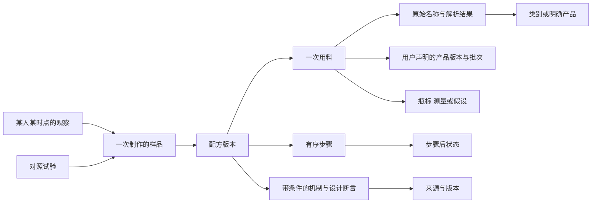

# V2：配方、工艺与试饮闭环

更新：2026-10-06。旧的 evaluate / complete / feedback 接口继续保留。

## 从网页开始

1. 工作台选择 Sour，输入配方或手边材料，点击“比较 Sour 候选与试饮方案”。
2. 比较原版、少量减糖浆、等体积用水替换糖浆。浓度缺资料就留空；可展开填写实际产品、批次、瓶标或测量依据。
3. 选择一个改版与原版生成 A/B 计划。A/B 的呈现顺序随机分配，配方仍可见，所以不称盲评。
4. 实际制作后分别保存两杯观察：时间点、感官强度、七维质量、喜欢程度和实测温度。未评项留空。
5. 两杯在同一时间点都有观察后，记录偏好。保存的计划可重新载入查看。每次新的制作应创建新计划。

同一杯的 0 秒和 120 秒是重复测量。系统按不同计划计有效对照数，不能据此保证统计独立性。当前至少 3 组、某策略获胜超过一半才影响排序，这是明确的编辑启发式，不是显著性检验或因果效应估计。

只有同一品鉴者、相同参照快照（含批次、成分和工艺条件）的有效反馈会影响该参照的下一次排序。合成试验、无法判断、平局、有制作偏离以及已更正观察所支持的旧结果不进入排序。更正后需重新提交比较结果。未知材料条件不代表实验已控制这些因素。

## 图谱结构



这是领域与证据关系图。配方指纹包含用料、技法和 context；批次不同会产生不同参照。标准类别、产品、用户声明的产品版本、批次、成分记录分别建节点。材料标签不自动证明品牌对应或化学组成相同。

`graph` 返回当前评价的关系投影，未知名称保留 Resolution，不强行连接标准实体。机制节点保留条件、来源、知识版本和空 effect_size；设计提示标为编辑应用。旧评价和试验保留当时的图与快照，不自动重解释为新知识。

同一机制的通用断言与每份配方的适用情况分开建节点；来源也带知识版本，合并不同配方或知识快照时不会覆盖旧依据。

```sh
python scripts/build_graph_v2.py
```

该命令将已有对齐语料投影到本地 `data/knowledge/domain-v2.json`，保留来源版本与每行用料。不改 raw/processed，不把全部名称强行合并，不自动增加词典覆盖率。推荐器仍使用原有来源检索，再把匹配、机制依据与候选绑定；图遍历没有替代所有算法。

## 请求入口

将下列合成示例保存到项目 `data/work/`，使用：

```sh
python -X utf8 scripts/advise.py --request data/work/request.json --compact
```

HTTP 使用 `POST /api/<action>`，请求体省略 action 也可。网站只监听本机。

### 比较候选

```json
{
  "action": "recommend",
  "frame": "sour",
  "recipe": "gin 45ml, lemon_juice 25ml, simple_syrup 20ml",
  "method": "shake",
  "taster": "local",
  "context": {
    "materials": [{"name":"gin","product_label":"Synthetic fixture","variant":"example","batch":"demo-01"}],
    "dilution_ml": 20,
    "composition": [
      {"name":"gin","abv":40,"sugar_g_l":0,"acid_g_l":0,"basis":"assumption","source":"synthetic example"},
      {"name":"lemon_juice","abv":0,"sugar_g_l":20,"acid_g_l":50,"basis":"assumption","source":"synthetic example"},
      {"name":"simple_syrup","abv":0,"sugar_g_l":600,"acid_g_l":0,"basis":"assumption","source":"synthetic example"}
    ]
  }
}
```

示例数值全是假设，不是典型果汁或产品实测。候选保留用户原用量，改量仅发生在新版本。少糖浆策略步长为至多 2.5 ml、原糖浆量的 12.5%；这是可测试的编辑约定。等体积替换也可能改变有香气糖浆的风味；浓度变化与“好喝改善”分开。

只有证据图中启用的酸甜交互断言存在时才生成糖浆对照；已声明零糖的糖浆不套用减糖策略。这些断言支持试验问题，不证明候选更好喝。

返回 `candidates[].snapshot / composition_changes / evidence_ids / trace`。排序优先操作约束，再参考符合条件的个人反馈；没有感官预测值。`pantry_alternatives` 保留已有材料中的角色替代候选，未默认等量替换。avoid 包含水时不生成用水替换方案。

此版本多候选只支持单一基酒、酸源、可计量糖浆和可选水的 Sour；分基酒、蛋清、复杂辅料、整杯澄清和其他框架继续使用原 Judge，不自动套用此策略。

### 材料与步骤

`context.materials`：每项须有已识别的 name，以及至少一个 product_label / variant / batch。每个原料 ID 只绑定一份材料记录；多批次混用尚需扩展用料接口。所有标签保留本地。

可选 `context.process.steps` 示例：

```json
[
  {"op":"add","uses":[0,1,2]},
  {"op":"shake","water_ml":20,"duration_s":12},
  {"op":"strain"},
  {"op":"serve","temperature_c":-3}
]
```

`uses` 是请求配方行的零起始索引。每行必须且只能 add 一次；serve 必须在最后。12 秒只是该情景的记录值，不是推荐时长。支持 add、add_water、shake、stir、strain、clarify、carbonate、serve。最多 40 步；duration_s / temperature_c 是声明条件，不自动模拟冷却。

shake / stir 的 water_ml 记录该步新增融水；省略意味着未知。add_water 必须写 water_ml。配方行里已有的水不再写入步骤水量；dilution_ml 如提供，表示全部步骤总额外水量，不会再次相加，矛盾输入会报错。粗滤不会自动标记澄清，clarify 会使成品浓度与体积保持未知。充气不生成设备压力指令。

`judge.composition.process_trace` 返回各步的原料集合、近似体积、测温和保留率边界。先摇无气部分再加入苏打与先加入苏打再摇会触发不同检查。缺少步骤仍兼容旧式条件提示。网页显示和保留导入步骤；详细步骤目前通过 JSON 提供。

### 创建并观察试验

- `experiment_create`：与 recommend 相同的输入，再提供 candidate_id（less_syrup / water_swap）、可选 request_id、data_kind（real / synthetic）。返回固定的随机分配、session_id、serving_id 和配方快照。同一 request_id 重试保持分配不变。
- `experiment_history`：返回本地计划、观察和比较结果。
- `graph`：使用与 evaluate 相同的配方输入返回图投影。

合成计划（data_kind: synthetic）记录观察时必须 `tasting.tasted:false`，可填写明确人为设定的模拟分数；感官报告和图节点都标记 synthetic。真实计划仍要求 `tasted:true`。普通 feedback 接口不接受未试饮评分，合成记录永远不进入真实排序。

观察请求，用计划返回的真实 ID 替换占位符：

```json
{
  "action":"experiment_observe",
  "experiment_id":"<returned experiment id>",
  "serving_id":"<returned serving id>",
  "tasting":{"tasted":true,"ratings":{"balance":7},"overall_liking":7,"notes":"仅填写真实观察"},
  "observation":{"as_planned":true,"timepoint_s":0,"temperature_c":-2,"intensities":{"sweet":6,"sour":5},"deviations":""},
  "request_id":"unique-observation-request"
}
```

感官强度支持 sweet / sour / bitter / alcohol_heat / aroma / body / carbonation / astringency，均为 0–10。观察还可填写 observed_volume_ml。温度与体积按时间点记录，不改同一杯的制作快照。

实际配方不同则 `as_planned:false`，提供 observation.actual_snapshot，完整包含 frame、recipe、method、context。此类记录保存供解释，但不进入当前受控比较排序。网页目前提供按计划记录和偏离说明；实际快照通过 JSON 提供。

同杯同时间点不能重复占样本；更正使用新 request_id 并提供 `supersedes_observation_id`。旧记录保留，最新观察取代旧观察参与比较。不同时间点不能换成不同实际配方。

同一请求 ID、相同原始输入的重试返回原记录，即使知识版本已更新或观察后来被更正，也不会重算旧记录。新比较或更正必须使用新的请求 ID。

比较请求：`action: experiment_choose`，提供 experiment_id、preferred（A / B / tie / inconclusive）、timepoint_s 和可选 request_id。两杯在同一时间点都需有真实观察。更新比较结果会保留历史，排序每个计划只取最近一次有效结果。

## 边界与发布

所有计划和反馈仍写本地 `data/feedback/advisor.sqlite`，使用新的记录种类，不迁移或删除旧试饮。图投影和请求也在 data/ 内。测试使用隔离数据库和合成配方，网页验收不写个人试饮库。

尚未实现：完整产品数据库、普适风味预测、过滤保留率模型、自动证据采纳、因果效应拟合、可视化步骤编辑器和所有框架的多候选策略。已有证据支持条件性机制提示；本次新增排序阈值和试验流程是项目设计，不冒充书籍或论文结论。

## English summary

V2 adds stable domain identities, ingredient-use and resolution records, declared product variants and batches, composition provenance, ordered process states, and local paired trials. Sour candidates expose dose and concentration tradeoffs while sensory predictions stay null. Unknown melting, clarification losses and ingredient identity are preserved explicitly.

The CLI and localhost API expose recommend, graph, experiment_create, experiment_observe, experiment_choose and experiment_history. Trial allocation is randomized and retry-safe, but not blinded. Observations separate intensity, quality and liking. Corrections invalidate dependent comparisons; synthetic or deviating trials do not affect ranking. Personal ordering is restricted to the same taster and reference snapshot and remains a heuristic, not causal inference. Private data and graph exports never enter the public repository.
